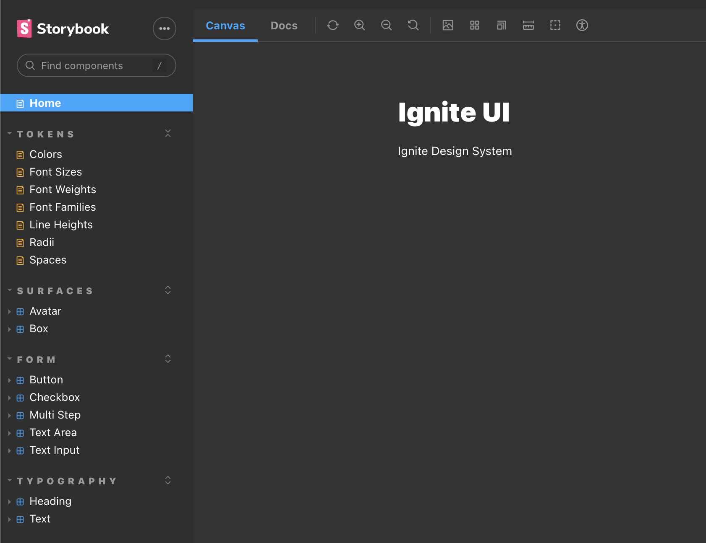

<div align="center">
  <h1>Design System</h1>
</div>

<p align="center">
  <a href="#-about-the-project">About the project</a> •
  <a href="#-technologies">Technologies</a> •
  <a href="#-getting-started">Getting started</a> •
  <a href="#-license">License</a>
</p>

<p align="center">
  
</p>

## 👩‍💻 About the project

[Design System]() is just a simple project for a design system.
You can check the documentation [here](https://henriquecampaner.github.io/design-system-ignite/)
## 🚀 Technologies

- [ReactJS](https://reactjs.org/)
- [TypeScript](https://www.typescriptlang.org/)
- [StoryBook](https://storybook.js.org/)
- [Stitches](https://stitches.dev/)
- [Radix](https://www.radix-ui.com/)
- [Turborepo](https://turbo.build/)

## 💻 Getting started

### Requirements

- [Node.js](https://nodejs.org/en/)
- [Yarn](https://classic.yarnpkg.com/) or [NPM](https://www.npmjs.com/) _(examples are with yarn)_

**Clone the project and access the folder**

```bash
$ git clone https://github.com/henriquecampaner/design-system-ignite && cd design-system-ignite
```

**Follow the steps below**

```bash
# Install the dependencies
$ npm install

# Start the app
$ npm run dev
```

## 📝 License

This project is licensed under the MIT License - see the [LICENSE](LICENSE) file for details.

---

.

<p align="center">
  Made with 💜&nbsp; by <a href="https://www.linkedin.com/in/henrique-campaner/">Henrique Campaner</a>
</p>